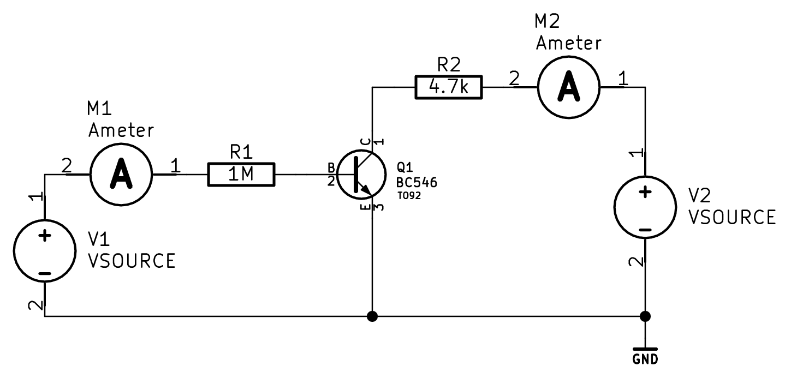
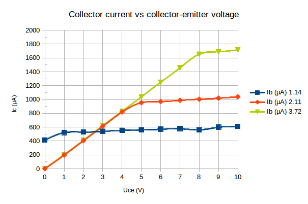
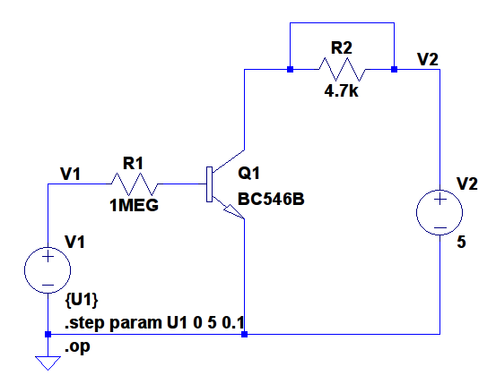
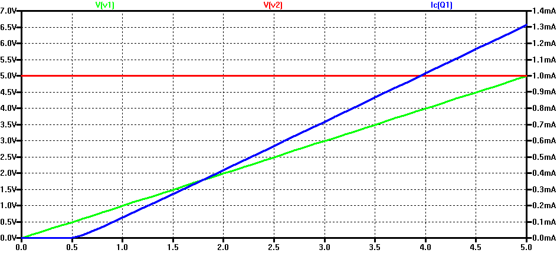
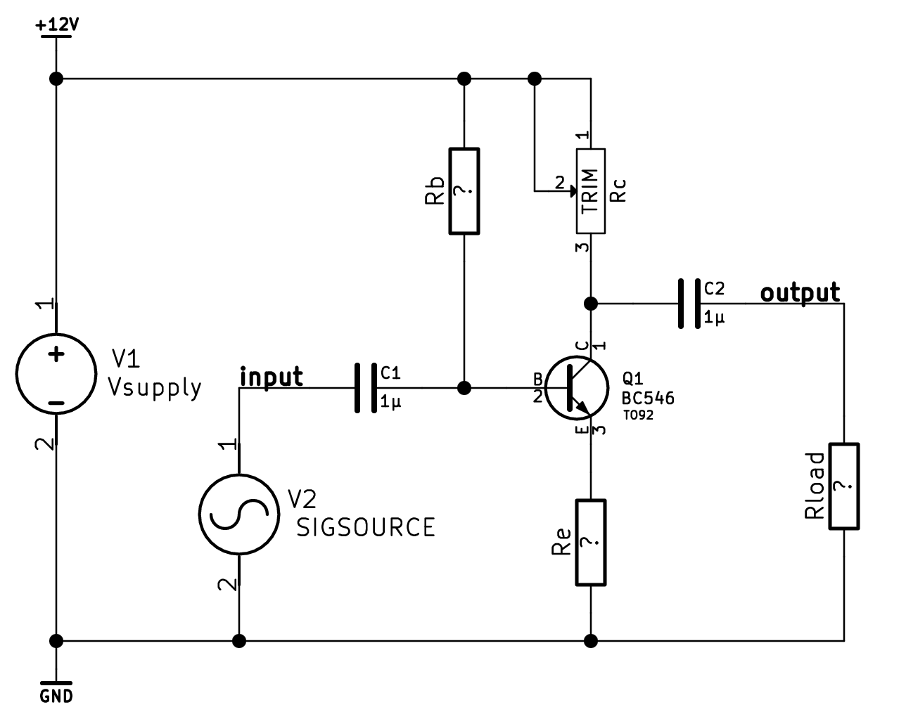
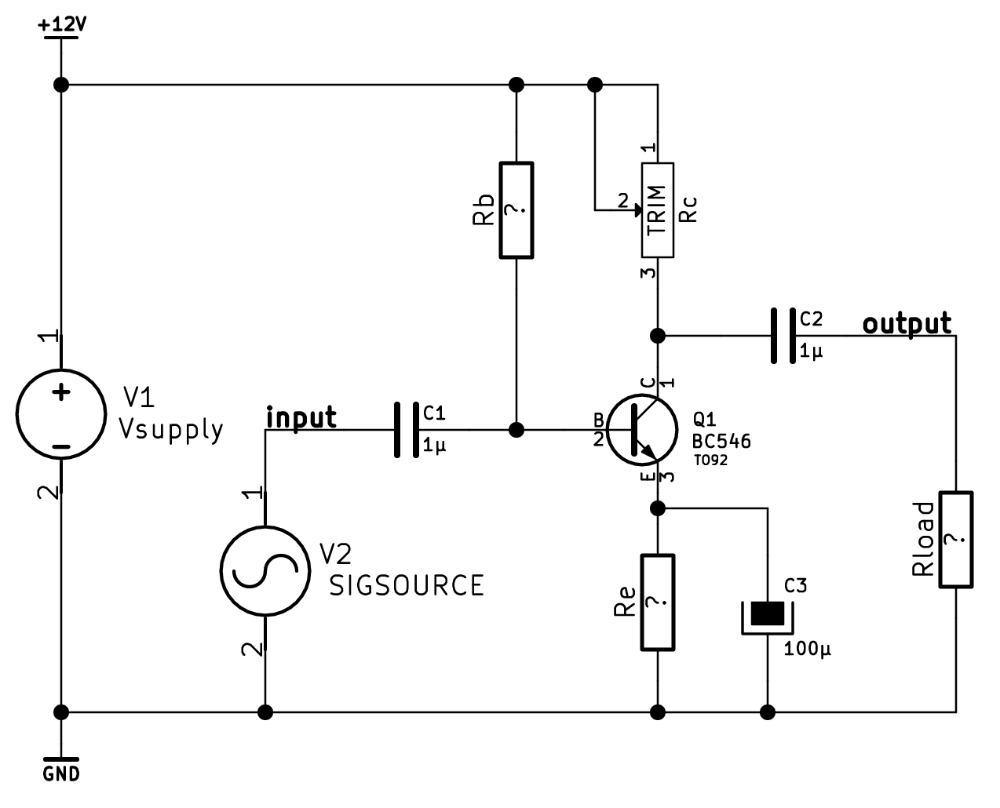
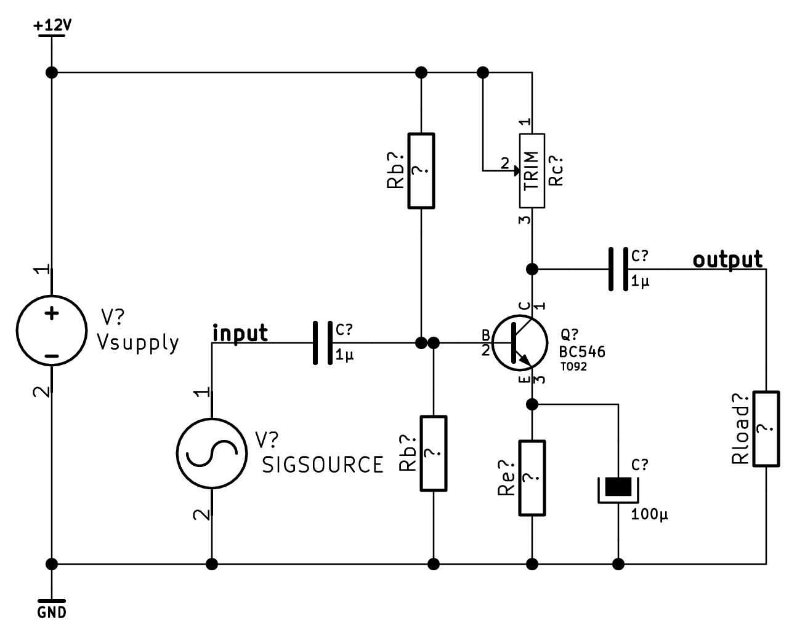
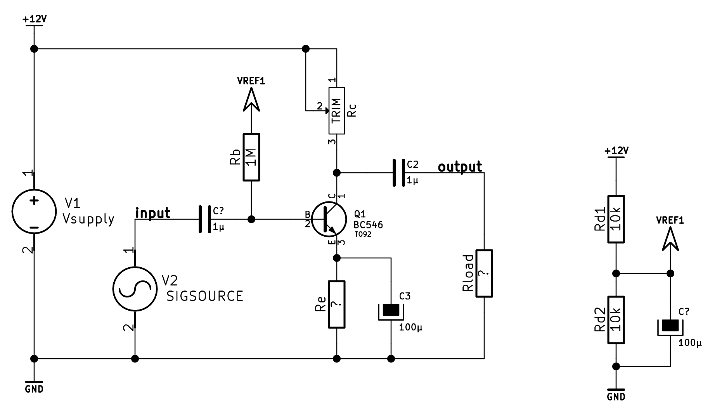

Ic-Uce-characteristics
======================

Circuit
-------

###Fixed collector voltage
With the collector resistor R2 left out or shorted, an adjustable power supply
is connected directly across the collector-emitter junction, fixing the
collector voltage. First we get the base currents for known collector currents.
Adjusting voltage V1 translates to varying the base current Ib and in turn the
collector current Ic.
The transistor used is a BC547C.

###Measurements

Ic (mA)     Ib (µA)
-------     -------
0.5         1.14
1.0         2.11 
1.8         3.72 

Table: Measurement of base current vs collector current

The base current is then held at a constant value and the collector-emitter
voltage is swept over a range of 0-10V in 1V steps.
The results is given in the plot.

###Simulation

Spice circuit simulation confirms that measurements reflect typical bjt
characteristics. The program used is Linear Technology ltspice, models extracted
from transistor datasheet parameters.

Quiescent conditions
====================

Circuit
-------
E = 10V Rc = 4.7k

###Curve
TODO

Uce-Ib transfer function
=======================
Examine the output signal of the first circuit. Determine the linearity of the
output, as in the relation of Uce to Ib.
Uses the measurement setup and circuit shown in Figure 1.

Ic-Ib-characteristics and current amplification
===============================================

Measurements
------------

Comments
--------
TODO: Comment the curve, calculate current amplificationfactor deltaIc/deltaIb
in regions of interest.

BJT biasing
===========

Rb          Ve          Ve          Rc 
--          --          --          --
390kΩ       00          00          00
470kΩ       00          00          00
560kΩ       00          00          00
680kΩ       00          00          00
820kΩ       00          00          00
1MΩ         00          00          00

BJT amplifier
=============

###Amplification

                        Without AC bypass       AC bypassed
                        -----------------       -----------
Input voltage (mVtt)    111                     111
Output voltage (Vtt)    111                     111
Voltage gain (multiple) 111                     111
Voltage gain (dB)       111                     111
Phase shift (degrees)   111                     111

Table: Amplifier gain measurements

###Frequency response

###Improved biasing
The one resistor base bias is in practice not very reliable as it is dependant on transistor
beta. A more practical design that scales better for production adds a second resistor, forming
a voltage divider that fixes the base at a suitable level. For maximum dynamic range half of Vsupply,
plus a diode drop to compensate for the base-emitter voltage.

###"Noiseless" biasing
For small signals and high input impedance, the biasing can be improved further in terms of bias voltage
"stiffness" and power supply noise rejection. 

