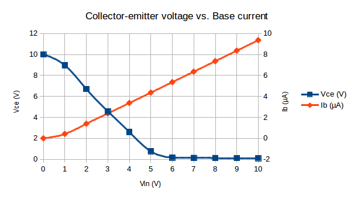
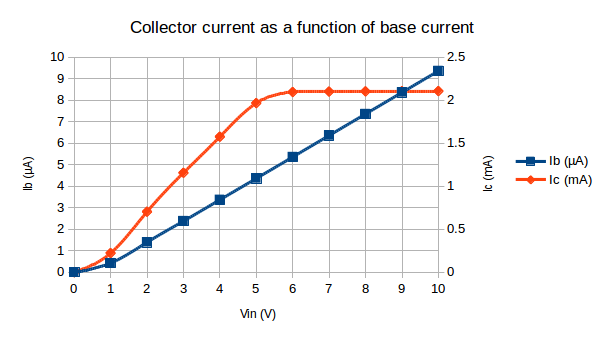
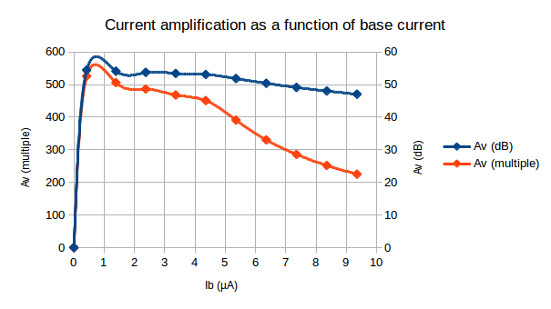
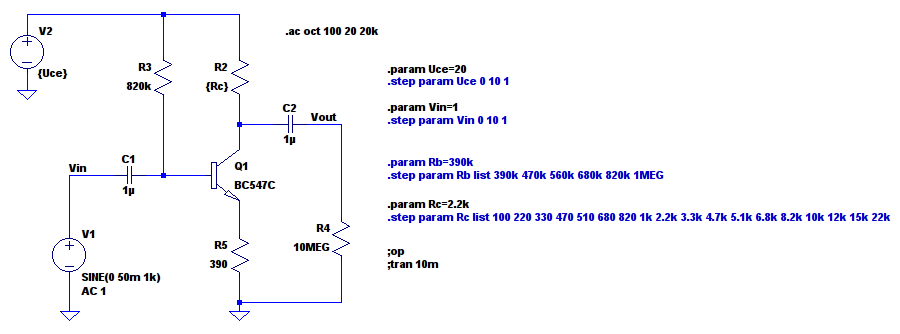
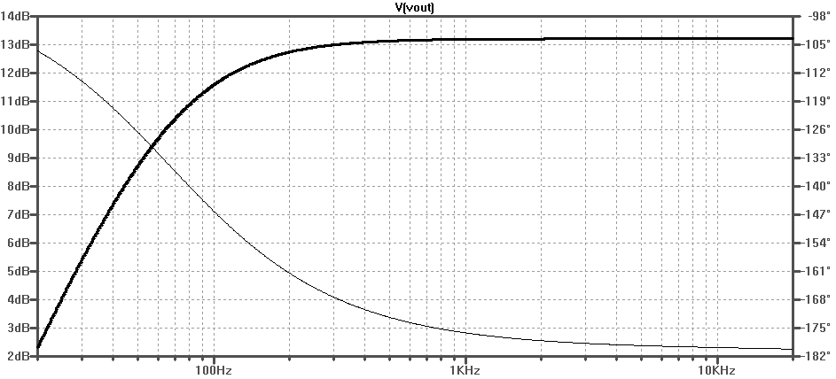

\newpage

Ic-Uce-characteristics
======================

Circuit
-------

\

###Fixed collector voltage 
With the collector resistor R2 left out or shorted, an adjustable power supply
is connected directly across the collector-emitter junction, fixing the
collector voltage. First we get the base currents for known collector currents.
Adjusting voltage V1 translates to varying the base current Ib and in turn the
collector current Ic.  The transistor used is a BC547C.

###Measurements

Ic (mA)     Ib (µA)
-------     -------
0.5         1.14
1.0         2.11 
1.8         3.72 

Table: Measurement of base current vs collector current

The base current is then held at a constant value and the collector-emitter
voltage is swept over a range of 0-10V in 1V steps. The results is given in
the plot.

\

###Simulation

Spice circuit simulation confirms that measurements reflect typical bjt
characteristics. The program used is Linear Technology LTspice, transistor
model extracted from transistor datasheet parameters.

Quiescent conditions
====================

Circuit
-------
..

Plot 
----
..

Uce/Ib transfer function
========================
Examine the output signal of the first circuit. Determine the linearity of the
output, as in the relation of Uce to Ib.
Uses the measurement setup and circuit shown in Figure 1.
The input voltage source is low enough impedance to be considered constant.
The linear region is very small, the transistor is best used as a switch in this
configuration.

\

Ic/Ib characteristics and current amplification
===============================================

Measurements
------------
Circuits are simulated in LTspice.

\

\

Comments
--------
Current gain decreases with base current. This is one of many nonideal
characteristics of the transistor. The phenomenon is called a "high injection
effect". Source included in references. 

BJT biasing
===========

Making Vce 10V maximizes the dynamic range of the amplifier, I.E. improves
linearity and reduces clipping of higher amplitude signals, by centering the
operating "bias" point. The available voltage is split evenly between the three
droppers; collector resistor collector-emitter resistance and emitter resistor.

Rb (Ω)      Ve (V)      Rc (Ω)  
------      ------      ------
390k        10.3        1
470k        9.3         47
560k        8.2         1k
680k        7.7         1k
820k        6.8         1.2k
1M          5.9         3.3 

Table: Bias resistor with bias voltages

\

The collector resistor would have to be a short to put Vce at 10V. This method
of biasing is thoroughly unpractical.

BJT amplifier
=============

###Amplification

\

                            Without AC bypass       AC bypassed
--------------------        -----------------       -----------
Input voltage (mVpp)        100                     100
Output voltage (Vpp)        0.283                   9.23
Voltage gain (multiple)     2.83                    91.3 
Voltage gain (dB)           9.04                    39.2
Phase shift (degrees)       180                     155

Table: Amplifier gain measurements

###Frequency response

Frequency response shows no high frequency rolloff in the audible frequency
range 20Hz-20kHz. There is however a high frequency limit, set primarily by
stray capacitances in breadboards and such.

###Improved biasing
The one resistor base bias is in practice not very reliable as it is dependant
on transistor beta. A more practical design that scales better for production
adds a second resistor, forming a voltage divider that fixes the base at a
suitable level. For maximum dynamic range half of Vsupply, plus a diode drop to
compensate for the base-emitter voltage.

\

###"Noiseless" biasing
For small signals and high input impedance, the biasing can be improved further
in terms of bias voltage "stiffness" and power supply noise rejection. 
The bias voltage is derived from a separate low impedance voltage divider,
heavily filtered and almost a short circuit as far as AC signals are concerned.
The bias voltage is tapped with a higher value resistor which effectively sets
the input impedance of the stage.

\

References
==========

WWW
---
Zeghbroech, B. Van - *High injection effects*, accessed 2014-11-28.
<http://ecee.colorado.edu/~bart/book/book/chapter5/ch5_4.htm>

Literature
----------
Horowitz and Hill -  *The Art of Electronics*, Cambridge University Press 1989.
Horowitz and Hayes - *Student Manual for the Art of Electronics*, Cambridge 1989.
Fairchild Semiconductor - *BC546/547/548/549/550 datasheet* Rev. A2, August 2002.

Sources
-------
Full source, including spice simulation files, CSV data, schematics, etc is
available at <https://github.com/jonasjberg/EE413-lab01>
